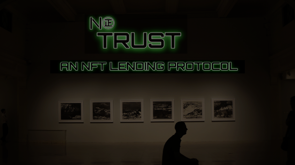

# NoTrust - ERC-721 tokens lending protocol
NoTrust is a Smart Contract allows NFT(ERC-721) owners to make their items more valuable. 

### 👍 Description
Every ERC-721 owner can set a waiting loan offer in this contract.
Buyers can use aave's aTokens to select a hopeful NFT(ERC-721). If NFT owner thinks it's a good deal, the NFT can be sold to the buyer. Or owner can use the highest bidder's aToken to borrow money from aave lendingPool.

### 🧾Deployed address on MainNet/TestNet
Not yet, sorry...

### TODO

- [x] nftMarket: create loan
- [ ] nftMarket: borrow from others
- [ ] use aave protocol(researching...)